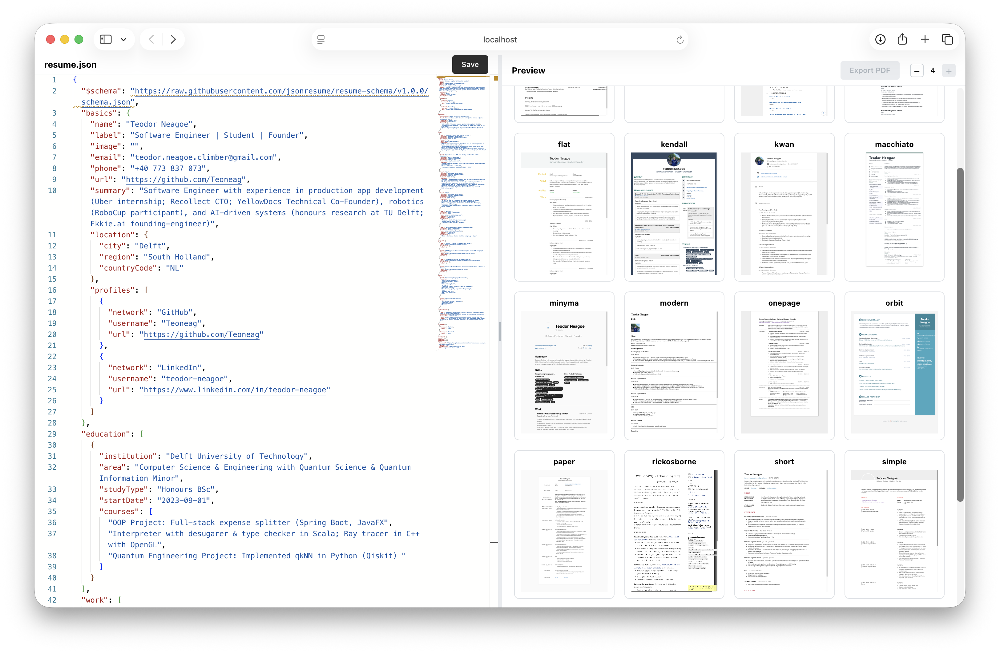
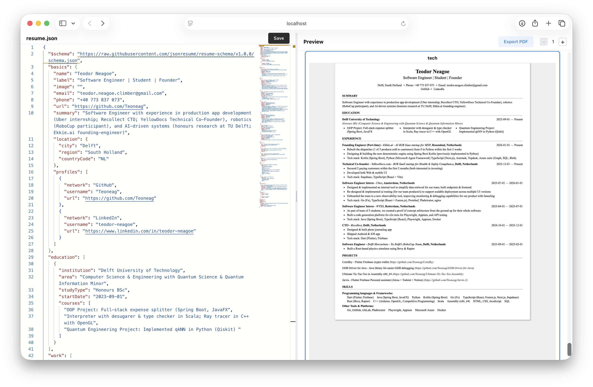

# JSON Resume Editor

Local visualization tool for [JSON Resume](https://jsonresume.org/).

Big library of themes to choose from:



After you select a theme, you can see the live preview:




## Getting Started

1.  Install & Run

```bash
npm install && npm start
```
Opens editor at `http://localhost:5173`.

2.  Add Themes:

```bash
npm install jsonresume-theme-<name>
```
(Restart server to load new themes).

## ToDo

- think about scrolling logic (I wanna see how it would look like on pdf with pages + I have to be able to click to select + i should be able to click on links from pdf)
- refactor by hand to lean React properly
- figure out why image doesn't work
- upload image
- click on text on the right and select on the left (like latex)
- make my own theme + allow which things to show